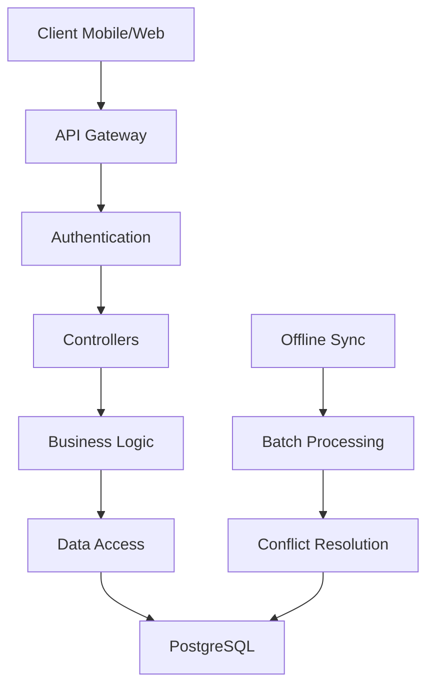
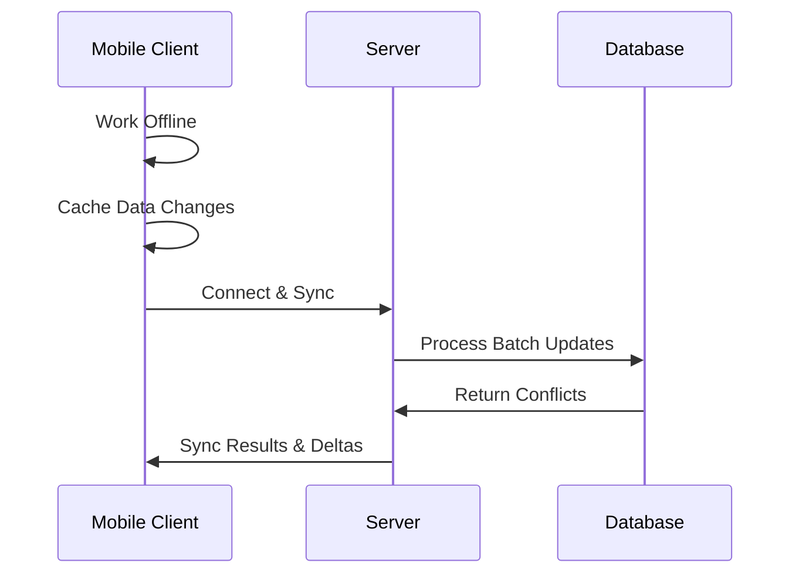

# 📘 SalesFlow-Lite Java Backend Architecture


The **SalesFlow-Lite Java Backend** provides a robust and scalable foundation for managing sales, inventory, and customer relationships. Built with **Spring Boot**, it is optimized for small to medium-sized businesses and supports offline-first workflows for sales teams.

### Key Features

* Spring Boot for rapid development and deployment
* Modular, layered architecture (Controller → Service → Repository)
* JWT-based security with role-based access control (RBAC)
* Offline synchronization for mobile and field agents
* ACID-compliant transactions with PostgreSQL

---

## 🎯 Key Design Principles

| **Principle**   | **Implementation**                                             |
| --------------- | -------------------------------------------------------------- |
| **Modularity**  | Layered architecture with clear separation of concerns         |
| **Scalability** | Stateless components and horizontal scaling support            |
| **Security**    | JWT authentication with role-based access control              |
| **Reliability** | ACID-compliant transactions for sales and financial operations |

---

## 🏗️ Architecture Overview

### System Flow Diagram




### Typical Sales Process Flow

Customer Onboarding → Product Catalog → Order Processing → Inventory Adjustment → Analytics & Reporting

### Business Benefits

* **Efficiency Gains**: Automated sales processes
* **Cost Reduction**: Optimized inventory management
* **Data-Driven Insights**: Real-time analytics and reporting

---

## 📁 Package Structure

```
src/main/java/com/salesflow/
├── config/                 # Configuration classes
│   ├── SecurityConfig.java
│   ├── DatabaseConfig.java
│   ├── OpenApiConfig.java
│   └── WebConfig.java
├── controller/             # REST Controllers
│   ├── CustomerController.java
│   ├── ProductController.java
│   ├── SaleController.java
│   ├── InventoryController.java
│   ├── UserController.java
│   └── ReportController.java
├── service/                # Business Logic Layer
│   ├── impl/               # Implementations
│   └── interface/          # Service contracts
├── repository/             # Data Access Layer
├── entity/                 # JPA Entities
├── dto/                    # Data Transfer Objects
│   ├── request/            # Inbound DTOs
│   └── response/           # Outbound DTOs
├── security/               # Auth & Authorization
├── exception/              # Custom Exception Handling
├── mapper/                 # Object Mapping
├── validation/             # Custom Validators
└── util/                   # Shared Utilities
```

---

## 🔐 API Design Architecture

### REST Endpoint Structure

```
/api/v1/
├── /auth
│   ├── POST /login
│   ├── POST /register
│   ├── POST /refresh
│   └── POST /logout
├── /products
│   ├── GET /
│   ├── POST /
│   ├── GET /{id}
│   ├── PUT /{id}
│   ├── GET /{id}/inventory
│   └── PUT /{id}/inventory
├── /customers
│   ├── GET /
│   ├── POST /
│   ├── GET /{id}
│   ├── PUT /{id}
│   ├── GET /my
│   └── GET /{id}/sales
├── /sales
│   ├── GET /
│   ├── POST /
│   ├── GET /{id}
│   ├── PUT /{id}/status
│   ├── GET /summary
│   └── POST /{id}/cancel
├── /inventory
│   ├── GET /alerts
│   ├── PUT /{id}/stock
│   ├── POST /{id}/adjust
│   └── GET /movements
├── /sync                  # Offline synchronization
│   ├── POST /upload
│   └── GET /download
└── /reports
    ├── GET /sales
    ├── GET /customers
    ├── GET /inventory
    └── GET /performance
```

---

## 📋 Architecture Decision Records (ADRs)

### ADR-001: Spring Boot Framework

* **Status:** Approved
* **Decision:** Spring Boot for rapid development
* **Consequences:** Faster setup, larger memory footprint

### ADR-002: Layered Architecture Pattern

* **Status:** Approved
* **Decision:** Controller → Service → Repository
* **Consequences:** Clear separation of concerns, potential for anemic domain model

### ADR-003: JPA/Hibernate

* **Status:** Approved
* **Decision:** Use JPA/Hibernate for ORM
* **Consequences:** Productivity gain, performance overhead in complex queries

### ADR-004: Mobile-First Synchronization

* **Status:** Approved
* **Decision:** Offline-first sync (last-write-wins)
* **Consequences:** Offline capability, possible data conflicts

### ADR-005: JWT for Authentication

* **Status:** Approved
* **Decision:** JWT tokens over session-based authentication
* **Consequences:** Scalable, cannot immediately revoke tokens

### ADR-006: PostgreSQL Database

* **Status:** Approved
* **Decision:** PostgreSQL over MySQL
* **Consequences:** Rich features (JSONB, full-text search)

---

## 🚀 Scalability Strategy

### Horizontal Scaling

* Stateless services
* JWT-based authentication
* Database connection pooling
* Redis caching for heavy read operations

### Performance Optimization

* Pagination on list endpoints
* Native queries for performance-critical operations
* Batch processing for synchronization
* Asynchronous operations where possible

---

## 🔒 Security Implementation

### Authentication & Authorization

* JWT access and refresh tokens
* Role-based access control (RBAC)
* Strong password policies

### Data Protection

* Input validation and sanitization
* SQL injection prevention via JPA
* XSS protection through encoding
* Password hashing using bcrypt

---

## 📱 Offline Synchronization

### Sync Architecture



### Conflict Resolution

* Initial: Last-write-wins
* Future: Enhanced conflict detection
* Manual resolution for critical conflicts

---

## 🗄️ Database Schema Overview

### Core Entities

* **User**: Authentication and authorization
* **Customer**: Customer information
* **Product**: Product catalog
* **Sale**: Sales transactions
* **SaleItem**: Line items in a sale
* **Inventory**: Stock levels and movements
* **Address**: Reusable address entity

---

## 🛠️ Development Setup

### Prerequisites

* Java 17+
* Maven 3.6+
* PostgreSQL 12+
* Spring Boot 3.0+

### Configuration

* Database connection pooling
* JWT secret management
* CORS setup for frontend
* OpenAPI/Swagger for API documentation

---


