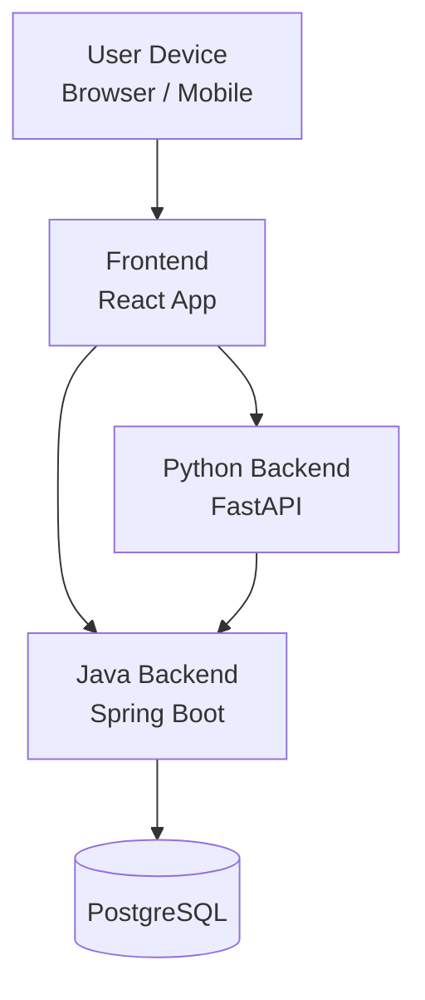
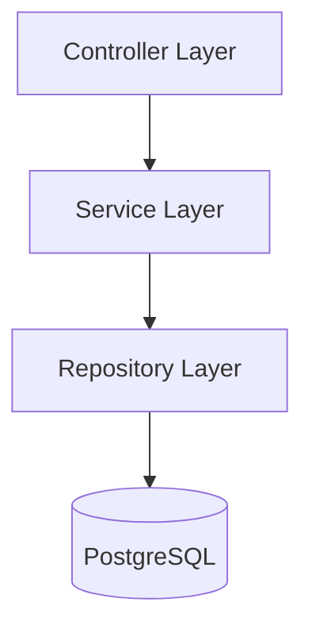
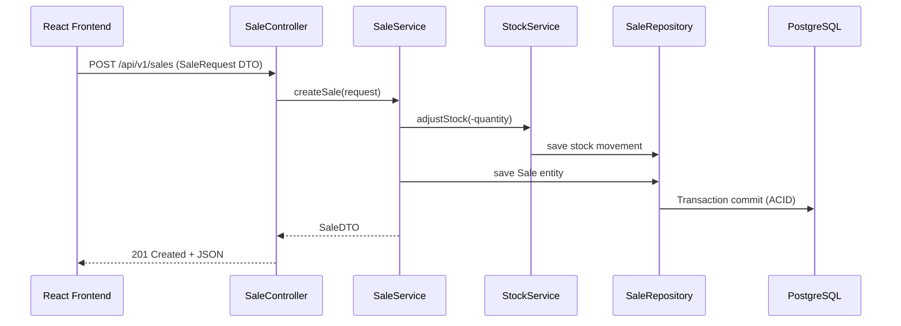
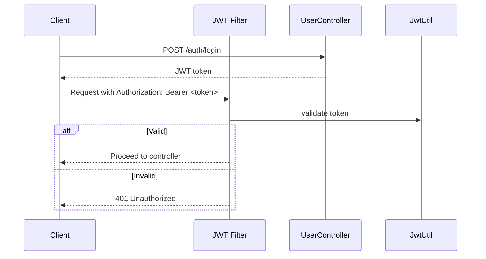
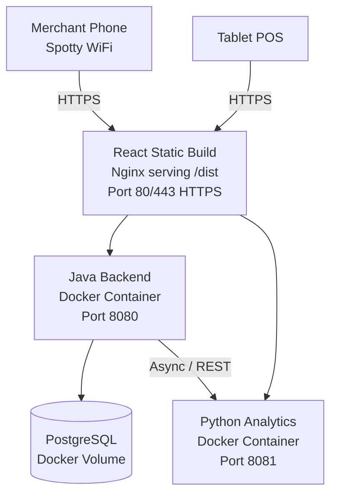
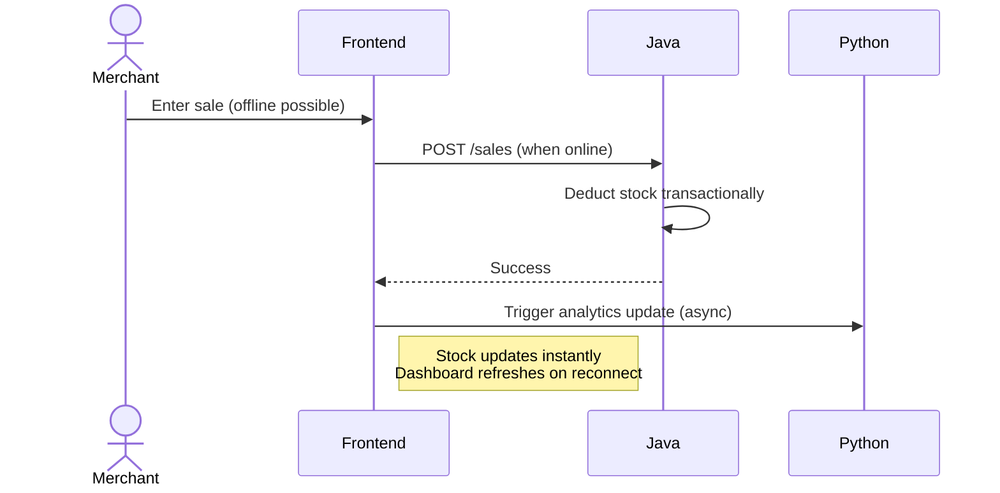
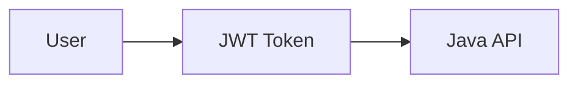
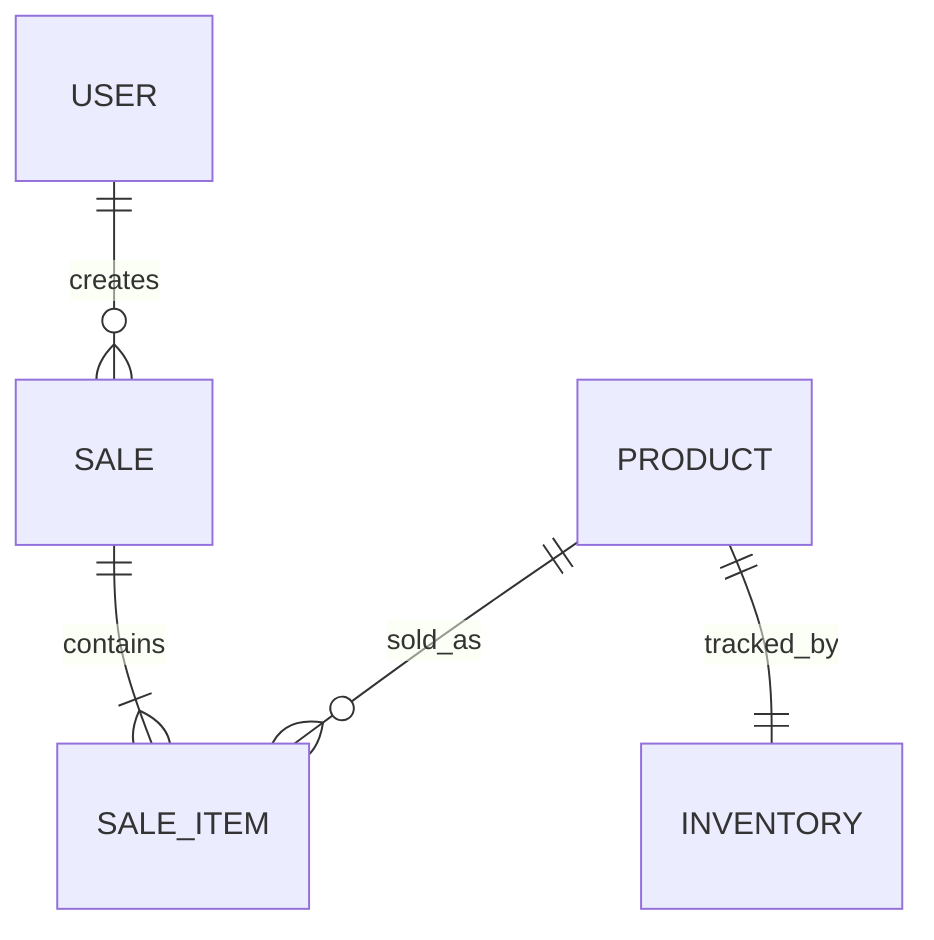

# 📘 SalesFlow-Lite Java Backend – Architecture & Design

This document describes the **architecture and design** of the **SalesFlow-Lite Java Backend**, focusing on **structure, interactions, behavior, and design decisions**.
It aligns with the **overall SalesFlow Lite system architecture** (React + Java + Python) and uses the **4+1 Architectural View Model** for clarity and completeness.

---

## 🔑 Context & Role in the System

The Java backend is the **core business engine** of SalesFlow Lite. It owns:

* Sales transactions
* Inventory & stock consistency
* Authentication & authorization
* Business rules and validations

It is optimized for **offline-first usage**, **high consistency**, and **low-latency operations**.

### System Context Diagram



**Key Responsibility Split**

* **Java Backend** → System of Record (SoR)
* **Python Backend** → System of Insight (analytics & ML)

---

## 🧠 Architecture Style & Patterns

### Primary Architecture Patterns

### Primary Architecture Patterns

| Pattern                              | Usage & Why It Matters in SalesFlow-Lite                                                                 |
|--------------------------------------|----------------------------------------------------------------------------------------------------------|
| **Layered Architecture**             | Strict flow: Controller → Service → Repository → Entity. Keeps concerns separated – easy to test and maintain stock/sales logic without UI leaks. |
| **MVC (Model-View-Controller)**      | Spring Boot's core – Controllers handle HTTP, Services business rules, Entities/DB models. Perfect for REST APIs consumed by React. |
| **Repository Pattern**               | Spring Data JPA interfaces (e.g., ProductRepository) abstract DB access. We get CRUD + custom queries for free – less boilerplate, consistent data layer. |
| **DTO Pattern**                      | Separate request/response objects (e.g., SaleRequest DTO) from entities. Protects internal DB shape, avoids over-posting attacks, clean TypeScript interfaces in React. 
| **Global Exception Handling**        | @ControllerAdvice + GlobalExceptionHandler → consistent, user-friendly JSON errors (no stack traces to frontend). Critical for merchant trust and debugging. |


---
---

## 📋 Architecture Decision Records (ADRs)

Architecture Decision Records capture **why** key architectural choices were made, not just **what** was built.  
They provide long-term clarity for maintainers and future contributors.

### ADR-001: Spring Boot Framework

* **Status:** Approved  
* **Decision:** Use Spring Boot for backend development  
* **Rationale:**  
  * Rapid project bootstrap  
  * Strong ecosystem (Security, JPA, Validation)  
  * Production-ready defaults  
* **Consequences:**  
  * Faster development velocity  
  * Slightly larger memory footprint compared to lightweight frameworks  

---

### ADR-002: Layered Architecture Pattern

* **Status:** Approved  
* **Decision:** Adopt Controller → Service → Repository layering  
* **Rationale:**  
  * Clear separation of concerns  
  * Easier testing and maintenance  
  * Aligns with Spring Boot best practices  
* **Consequences:**  
  * Clean responsibility boundaries  
  * Risk of anemic domain model if business logic leaks into controllers  

---

### ADR-003: JPA / Hibernate ORM

* **Status:** Approved  
* **Decision:** Use JPA/Hibernate for persistence  
* **Consequences:**  
  * High productivity and rapid CRUD development  
  * Performance tuning required for complex queries  

---

### ADR-004: Mobile-First Synchronization

* **Status:** Approved  
* **Decision:** Offline-first synchronization using last-write-wins strategy  
* **Consequences:**  
  * Strong offline usability  
  * Potential data conflicts requiring future enhancement  

---

### ADR-005: JWT for Authentication

* **Status:** Approved  
* **Decision:** Stateless JWT-based authentication  
* **Consequences:**  
  * Horizontally scalable security model  
  * Tokens cannot be revoked instantly without extra infrastructure  

---

### ADR-006: PostgreSQL Database

* **Status:** Approved  
* **Decision:** PostgreSQL as primary database  
* **Consequences:**  
  * Advanced features (JSONB, full-text search, strong ACID guarantees)  
  * Slightly higher operational complexity than MySQL  

---

## 🏗️ 4+1 View Model

---

## 1️⃣ Logical View (Structural Model)

Shows the **static structure** of the Java backend and its layers.



### Layer Responsibilities

* **Controller Layer**

  * REST endpoints
  * DTO validation
  * Error mapping

* **Service Layer**

  * Sales logic
  * Stock updates
  * Transaction boundaries

* **Repository Layer**

  * JPA/Hibernate
  * Database access

---

## 2️⃣ Development View (Code Organization)

```plaintext
src/main/java/com/SalesFlowLite/inventory/
├── config/         # SecurityConfig, WebConfig, AsyncConfig
├── controller/     # ProductController, SaleController, UserController
├── service/        # ProductService, SaleService, StockService, AnalyticsService
├── repository/     # ProductRepository, SaleRepository, UserRepository
├── model/
│   ├── entity/     # Product.java, Sale.java
│   └── dto/        # ProductDTO.java, SaleRequest.java
├── security/       # JwtUtil.java, UserDetailsServiceImpl
├── exception/      # GlobalExceptionHandler, custom exceptions
└── InventoryApplication.java
```

**Key Rules**

* Controllers never access repositories directly
* Services define transactional boundaries
* DTOs isolate domain from API contracts

---

## 3️⃣ Process View (Behavior Model – Concurrency & Flows)

### Typical Sale Transaction Flow



### Authentication Flow:



---

## 4️⃣ Physical View (Deployment Model)



### Deployment Characteristics

* Stateless Java services
* Docker-based deployment
* Shared PostgreSQL database
* Optional Redis for caching

---

## 5️⃣ +1 Scenarios View (Use Case View – Key Behaviors)

### Scenario : Quick Sale (Core Use Case)



**Conflict Strategy**

* Transactional stock deduction prevents overselling even with concurrent sales
* Python update is fire-and-forget → dashboard trends stay fresh without blocking merchant

---

## 🔐 Security Architecture



### Security Measures

* JWT Access & Refresh tokens
* Role-Based Access Control (RBAC)
* BCrypt password hashing
* Input validation & sanitization

---

## 🗄️ Data Model Overview



**Core Aggregates**

* Sale (root)
* Product
* Inventory

---

## ⚙️ Transaction & Consistency Model

* ACID transactions for:

  * Sales creation
  * Inventory updates
* Optimistic locking for concurrency
* Idempotent APIs for sync endpoints

---

## 🚀 Scalability & Performance

### Scaling

* Horizontal scaling of Java APIs
* Connection pooling
* Read optimization via pagination

### Performance Techniques

* Native queries for reports
* Async operations for non-critical tasks
* Batch processing for sync

---

## 📐 Architecture Quality Attributes

| Attribute       | Strategy              |
| --------------- | --------------------- |
| Scalability     | Stateless services    |
| Reliability     | ACID transactions     |
| Security        | JWT + RBAC            |
| Maintainability | Clean layered design  |
| Usability       | Offline-first support |

---

