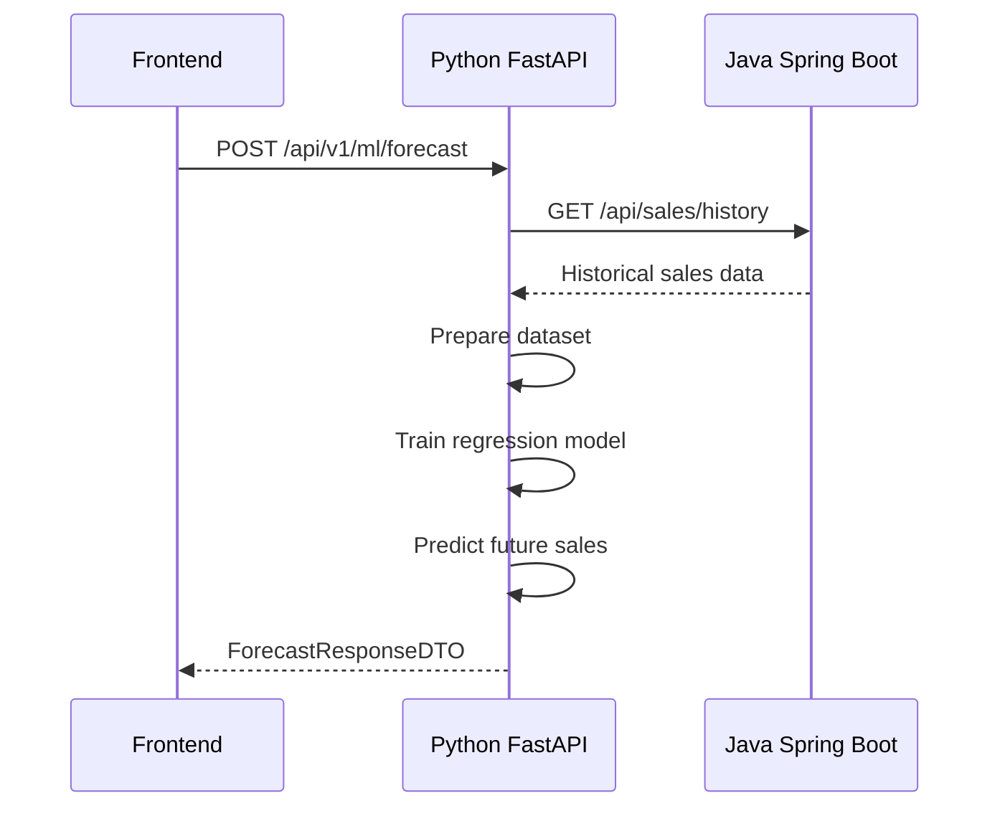
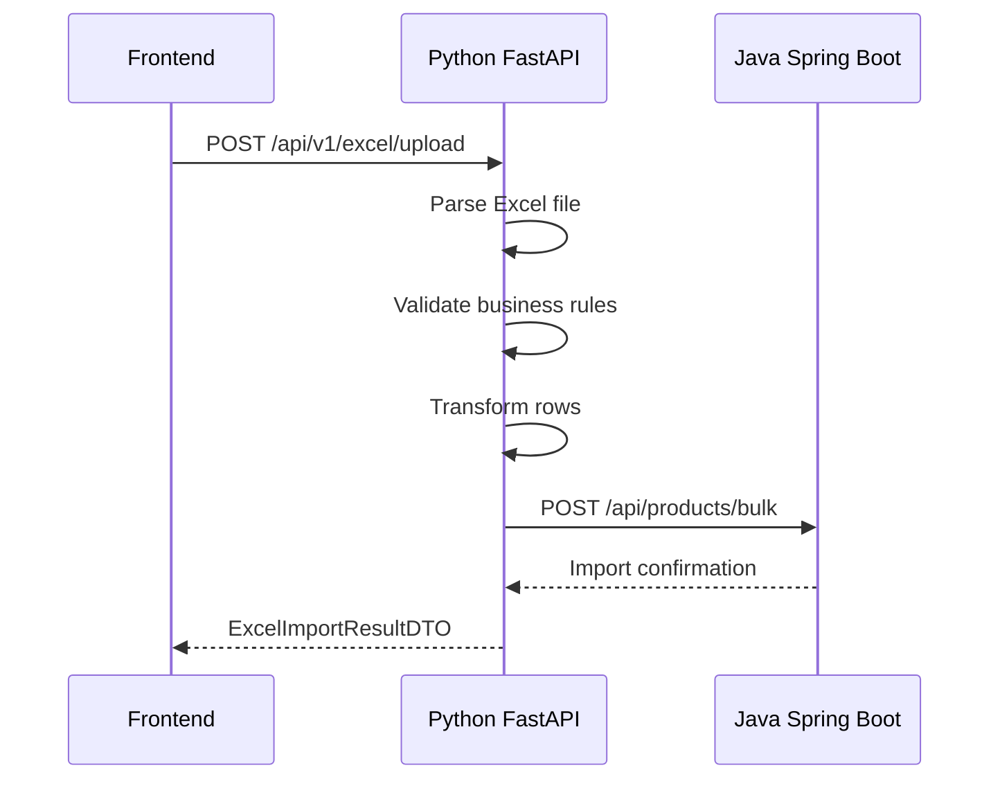
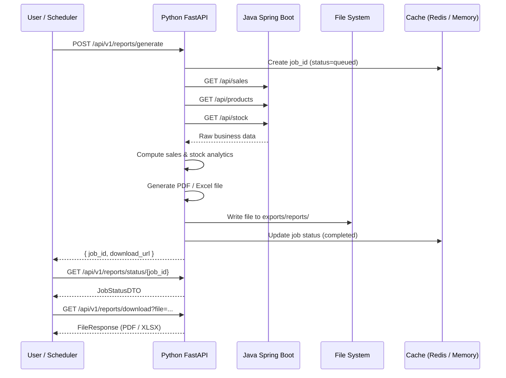
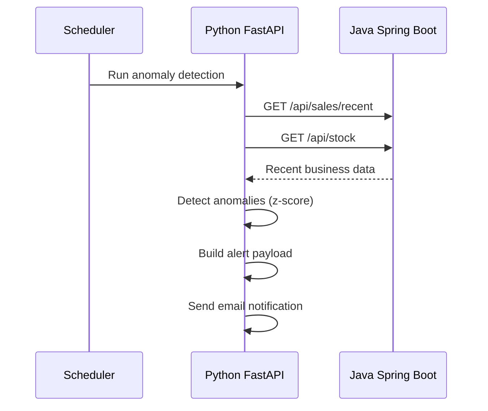
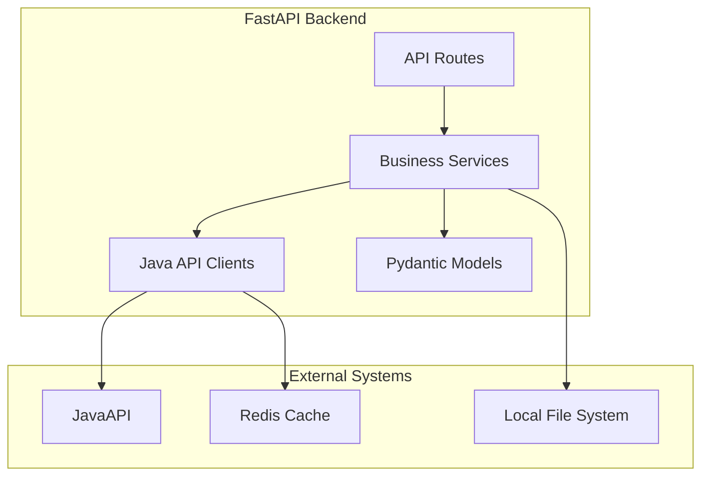
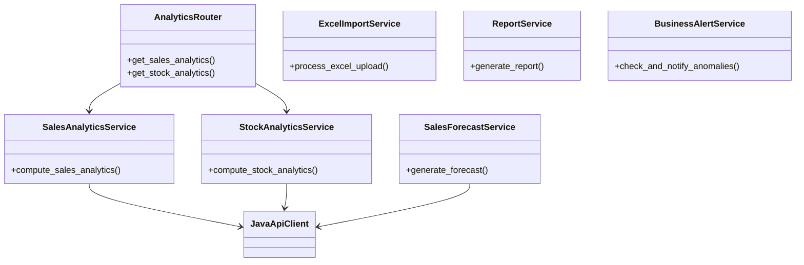
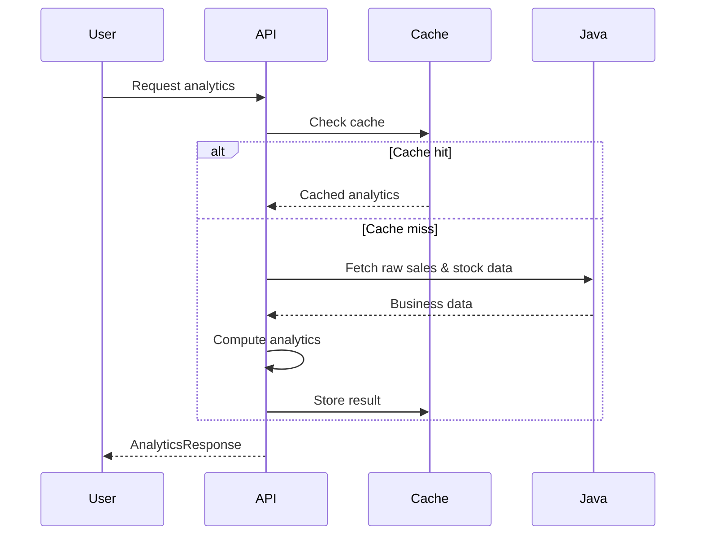
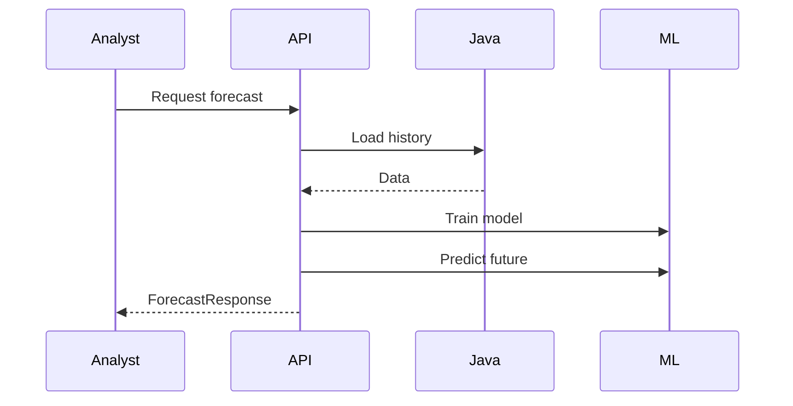

# 🧠 SALESFLOW – PYTHON ANALYTICS & AUTOMATION BACKEND

This document describes the **Python FastAPI backend** of SalesFlow.  
The backend acts as the **analytics, automation, and intelligence layer**, while Java remains the system of record.

The structure, scenarios, and architectural models are preserved as originally designed.  
Only **namespaces, services, and function names** have been aligned with the **actual implementation**.

---

## 🏗️ HIGH-LEVEL ROLE

- **Java Spring Boot** → Source of truth (products, sales, stock, persistence)
- **Python FastAPI** → Analytics, ML, automation, reporting, alerting

> **Python = Intelligent Brain** 🧠  
> **Java = Business Memory** 🏢

---

## 🔗 GLOBAL ARCHITECTURE

```mermaid
graph TB
    F[Frontend React] --> P[Python FastAPI]
    F --> J[Java Spring Boot]
    P --> J
    J --> DB[(PostgreSQL)]

    style P fill:#4caf50
    style J fill:#2196f3
    style DB fill:#9c27b0
````

---

# 📊 INTERACTION MODEL

## SCENARIO 1 — REAL-TIME BUSINESS & STOCK ANALYTICS DASHBOARD

### 🎯 Purpose

Display real-time **sales and stock analytics** with computed KPIs and trends.

### 🔄 Runtime Flow

```mermaid
sequenceDiagram
    participant F as Frontend
    participant P as Python FastAPI
    participant J as Java Spring Boot
    participant DB as PostgreSQL

    F->>P: GET /api/v1/analytics/sales
    F->>P: GET /api/v1/analytics/stock
    P->>J: GET /api/sales
    P->>J: GET /api/products
    P->>J: GET /api/stock
    J->>DB: Query sales, products, stock
    DB-->>J: Raw business data
    J-->>P: JSON responses
    P->>P: Compute KPIs, trends, low-stock alerts
    P-->>F: AnalyticsResponseDTO
```

### Python Components

* **Package**: `src.services.analytics`
* **Modules**:

  * `sales_analytics_service.py`
  * `stock_analytics_service.py`
* **Classes**:

  * `SalesAnalyticsService`
  * `StockAnalyticsService`
* **Functions**:

  * `compute_sales_analytics()`
  * `compute_stock_analytics()`

---

## SCENARIO 2 — SALES FORECASTING (ML PIPELINE)

### 🎯 Purpose

Predict future sales using a machine learning pipeline.

### 🔄 Runtime Flow



### Python Components

* **Package**: `src.services.ml`
* **Module**: `forecast_service.py`
* **Class**: `SalesForecastService`
* **Function**: `generate_forecast()`

---

## SCENARIO 3 — EXCEL IMPORT PIPELINE

### 🎯 Purpose

Upload, validate, and transform Excel business data.

### 🔄 Runtime Flow



### Python Components

* **Package**: `src.services.excel`
* **Module**: `excel_processor.py`
* **Class**: `ExcelImportService`
* **Function**: `process_excel_upload()`

---

## SCENARIO 4 — AUTOMATED REPORT GENERATION (ACTUAL IMPLEMENTATION)

### 🎯 Purpose

Generate business reports (PDF / Excel) using analytics data,
with **job status tracking**, **file persistence**, and **download access**.

### 🔄 Runtime Flow (As Implemented)



> Depending on the endpoint used, the report can also be returned directly
> via `StreamingResponse` (synchronous generation).

### Python Components

* **Package**: `src.services.reports`
* **Module**: `report_generation_service.py`
* **Class**: `ReportService`
* **Functions**:

  * `generate_report()`
  * `generate_sales_stock_report()`

---

## SCENARIO 5 — INTELLIGENT ALERTING SYSTEM

### 🎯 Purpose

Detect abnormal business behavior (sales or stock anomalies) and notify stakeholders.

### 🔄 Runtime Flow



### Python Components

* **Package**: `src.services.alerts`
* **Module**: `anomaly_alert_service.py`
* **Class**: `BusinessAlertService`
* **Function**: `check_and_notify_anomalies()`

---

# 🧩 STRUCTURAL MODEL



---

# 🧱 CLASS MODEL (LOGICAL VIEW)



---

# 🔄 BEHAVIOR MODEL

## SALES & STOCK ANALYTICS — CACHE-ASIDE



---

## ML FORECAST PIPELINE



---

# 📌 SUMMARY

| Layer       | Responsibility               | Technology          |
| ----------- | ---------------------------- | ------------------- |
| API         | Routing & security           | FastAPI             |
| Analytics   | Sales & stock analytics      | Pandas              |
| ML          | Forecast & anomaly detection | Scikit-learn        |
| Integration | Java communication           | HTTPX               |
| Cache       | Performance optimization     | Redis / Memory      |
| Reports     | PDF / Excel generation       | ReportLab, OpenPyXL |

---

## ✅ FINAL TAKEAWAY

* Java ensures **data integrity and persistence**
* Python transforms data into **analytics, intelligence, documents, and alerts**
* The backend is **pipeline-driven**, **cache-optimized**, and **automation-oriented**

This architecture clearly demonstrates:

* Analytics engineering
* ML pipelines
* Automation workflows
* Enterprise-grade backend design


