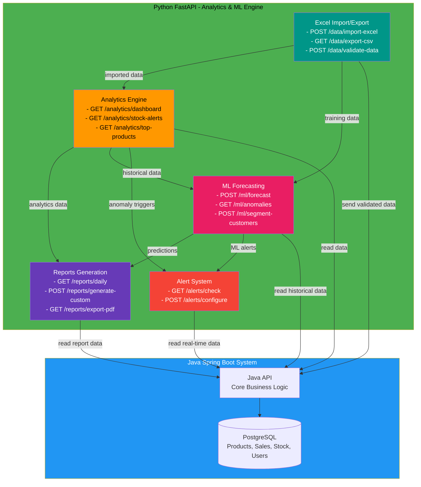
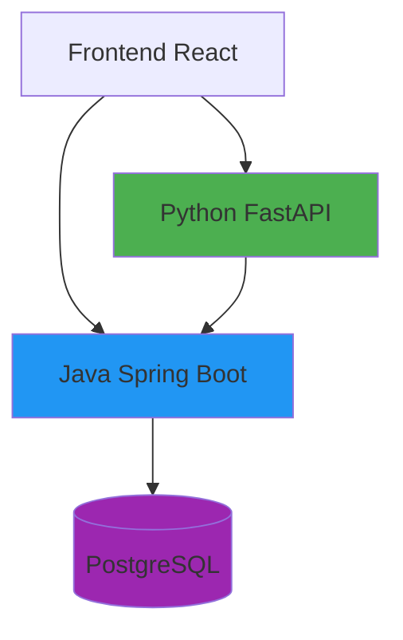
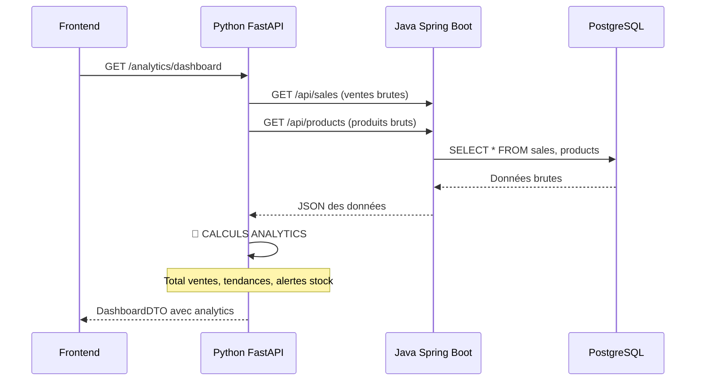
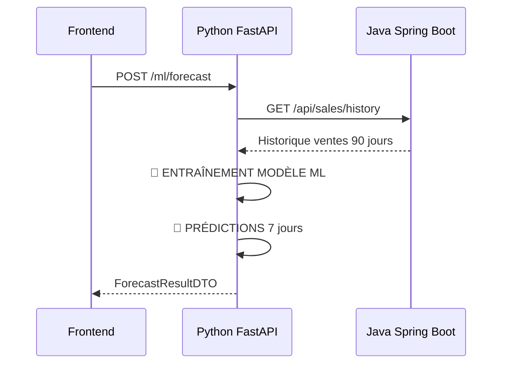
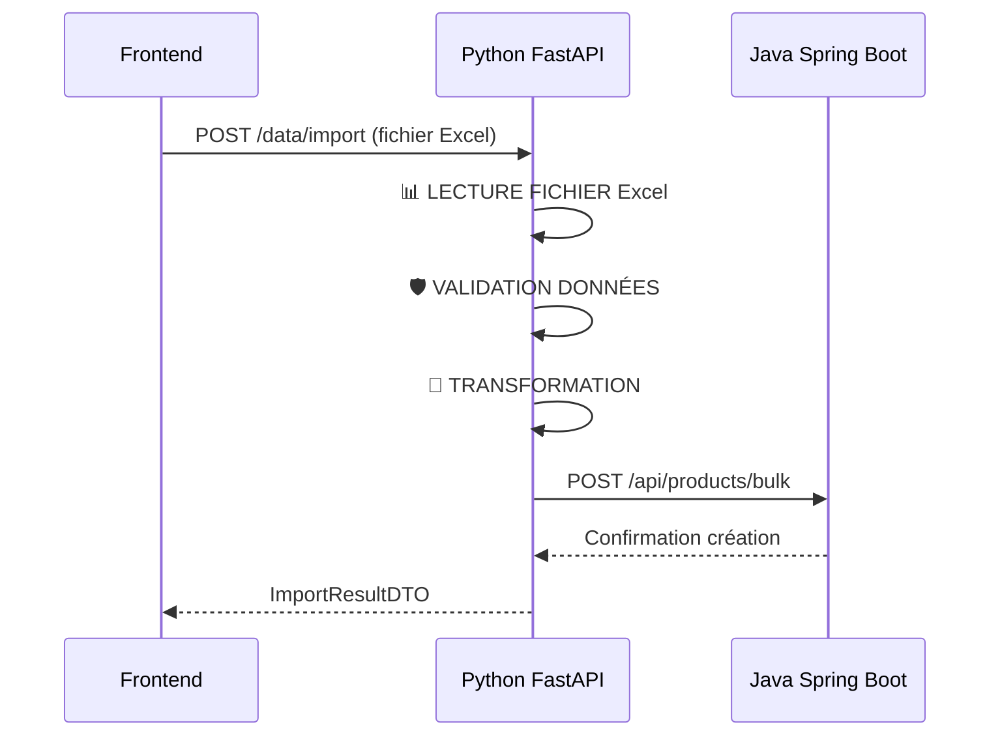
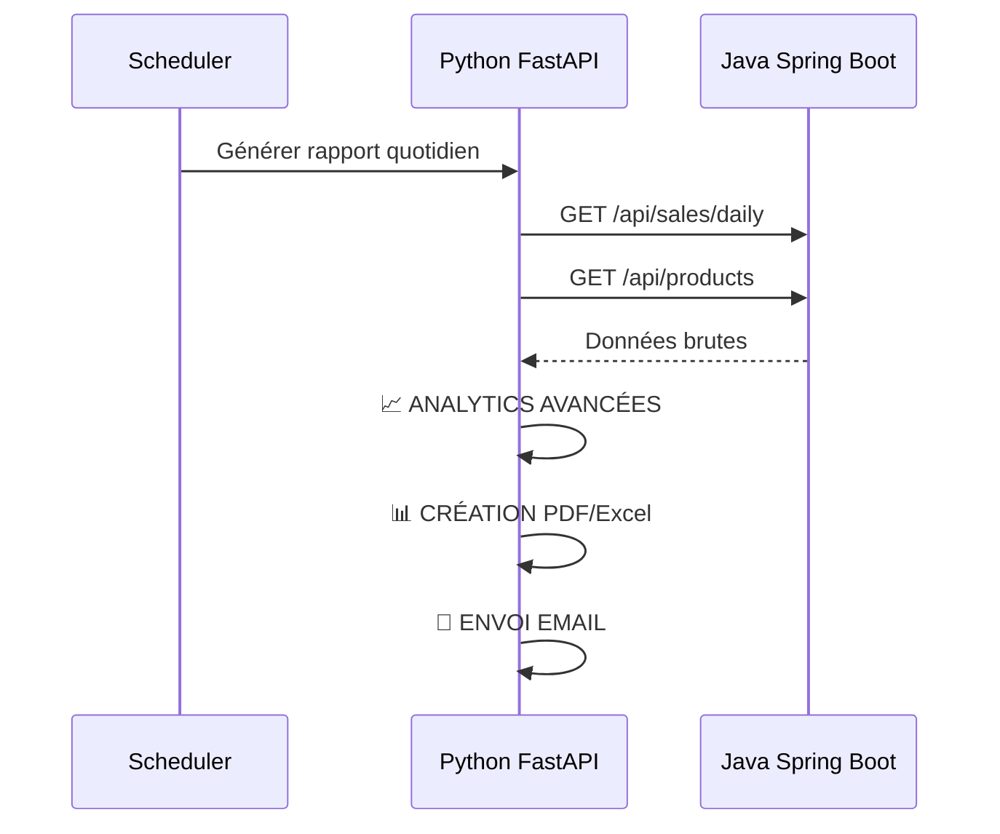
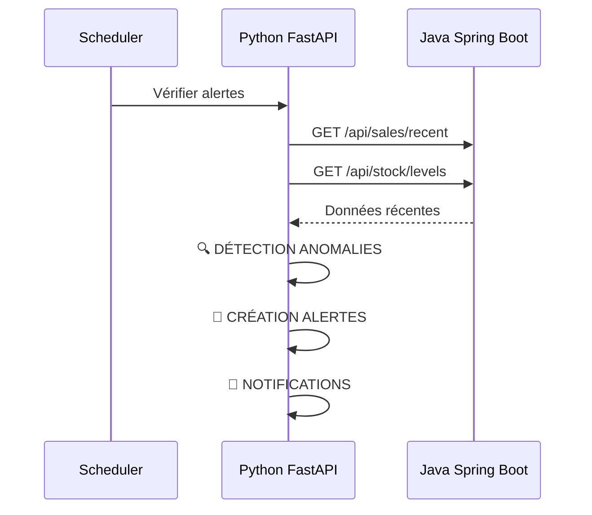

```mermaid
graph TD
    %% ==================== COUCHE API FASTAPI ====================
    subgraph FastAPI[Python FastAPI - Analytics & ML Engine]
        A1[Analytics Engine<br/>- GET /analytics/dashboard<br/>- GET /analytics/stock-alerts<br/>- GET /analytics/top-products]
        A2[ML Forecasting<br/>- POST /ml/forecast<br/>- GET /ml/anomalies<br/>- POST /ml/segment-customers]
        A3[Excel Import/Export<br/>- POST /data/import-excel<br/>- GET /data/export-csv<br/>- POST /data/validate-data]
        A4[Reports Generation<br/>- GET /reports/daily<br/>- POST /reports/generate-custom<br/>- GET /reports/export-pdf]
        A5[Alert System<br/>- GET /alerts/check<br/>- POST /alerts/configure]
    end

    %% ==================== CONNECTIONS INTERNES ====================
    A3 -->|imported data| A1
    A3 -->|training data| A2
    A1 -->|analytics data| A4
    A2 -->|predictions| A4
    A1 -->|historical data| A2
    A1 -->|anomaly triggers| A5
    A2 -->|ML alerts| A5

    %% ==================== CONNECTIONS EXTERNES ====================
    subgraph JavaSystem[Java Spring Boot System]
        J[Java API<br/>Core Business Logic]
        DB[(PostgreSQL<br/>Products, Sales, Stock, Users)]
    end
    
    J --> DB
    
    A1 -->|read data| J
    A2 -->|read historical data| J
    A3 -->|send validated data| J
    A4 -->|read report data| J
    A5 -->|read real-time data| J

    %% ==================== STYLES ====================
    style FastAPI fill:#4caf50,color:black
    style JavaSystem fill:#2196f3,color:white
    style A1 fill:#ff9800,color:black
    style A2 fill:#e91e63,color:white
    style A3 fill:#009688,color:white
    style A4 fill:#673ab7,color:white
    style A5 fill:#f44336,color:white
``` 
# relationships:

* **Excel Import/Export** → provides data to other modules
* **Analytics Engine** → feeds reports and machine learning
* **ML Forecasting** → enhances reports with predictions
* **Reports Generation** → aggregates all data to create reports
# 🎯 SCÉNARIOS CORRIGÉS - Architecture Réelle

## **🏗️ ARCHITECTURE OFFICIELLE**

```mermaid
graph TB
    F[Frontend React] --> P[Python FastAPI]
    F --> J[Java Spring Boot]
    P --> J
    J --> DB[(PostgreSQL)]
    
    style P fill:#4caf50
    style J fill:#2196f3
    style DB fill:#9c27b0
```

## **📊 SCÉNARIO 1: DASHBOARD TEMPS RÉEL**

### **🎯 Concept**
Dashboard qui montre les performances business en temps réel avec calculs analytics

### **🔄 Flux Réel**

```mermaid
sequenceDiagram
    participant F as Frontend
    participant P as Python FastAPI
    participant J as Java Spring Boot
    participant DB as PostgreSQL
    
    F->>P: GET /analytics/dashboard
    P->>J: GET /api/sales (ventes brutes)
    P->>J: GET /api/products (produits bruts)
    J->>DB: SELECT * FROM sales, products
    DB-->>J: Données brutes
    J-->>P: JSON des données
    P->>P: 🧠 CALCULS ANALYTICS
    Note over P: Total ventes, tendances, alertes stock
    P-->>F: DashboardDTO avec analytics
```

### **📦 Composants Python**
- **Package**: `src.services`
- **Module**: `analytics_service.py`
- **Classe**: `DashboardService`
- **Fonction**: `get_dashboard_data()`

---

## **🤖 SCÉNARIO 2: FORECASTING VENTES 7 JOURS**

### **🎯 Concept**
Prédire les ventes futures avec machine learning

### **🔄 Flux Réel**

```mermaid
sequenceDiagram
    participant F as Frontend
    participant P as Python FastAPI
    participant J as Java Spring Boot
    
    F->>P: POST /ml/forecast
    P->>J: GET /api/sales/history
    J-->>P: Historique ventes 90 jours
    P->>P: 🧠 ENTRAÎNEMENT MODÈLE ML
    P->>P: 🧠 PRÉDICTIONS 7 jours
    P-->>F: ForecastResultDTO
```

### **📦 Composants Python**
- **Package**: `src.services`
- **Module**: `ml_service.py`
- **Classe**: `ForecastingService`
- **Fonction**: `predict_sales()`

---

## **📁 SCÉNARIO 3: IMPORT/EXPORT EXCEL**

### **🎯 Concept**
Importer des données Excel, les valider et les envoyer à Java

### **🔄 Flux Réel**

```mermaid
sequenceDiagram
    participant F as Frontend
    participant P as Python FastAPI
    participant J as Java Spring Boot
    
    F->>P: POST /data/import (fichier Excel)
    P->>P: 📊 LECTURE FICHIER Excel
    P->>P: 🛡️ VALIDATION DONNÉES
    P->>P: 🔧 TRANSFORMATION
    P->>J: POST /api/products/bulk
    J-->>P: Confirmation création
    P-->>F: ImportResultDTO
```

### **📦 Composants Python**
- **Package**: `src.data`
- **Module**: `file_processor.py`
- **Classe**: `ExcelProcessor`
- **Fonction**: `process_import()`

---

## **📄 SCÉNARIO 4: RAPPORTS AUTOMATISÉS**

### **🎯 Concept**
Générer des rapports PDF/Excel avec analytics

### **🔄 Flux Réel**

```mermaid
sequenceDiagram
    participant S as Scheduler
    participant P as Python FastAPI
    participant J as Java Spring Boot
    
    S->>P: Générer rapport quotidien
    P->>J: GET /api/sales/daily
    P->>J: GET /api/products
    J-->>P: Données brutes
    P->>P: 📈 ANALYTICS AVANCÉES
    P->>P: 📊 CRÉATION PDF/Excel
    P->>P: 📧 ENVOI EMAIL
```

### **📦 Composants Python**
- **Package**: `src.services`
- **Module**: `report_service.py`
- **Classe**: `ReportGenerator`
- **Fonction**: `generate_daily_report()`

---

## **🚨 SCÉNARIO 5: SYSTÈME D'ALERTES INTELLIGENTES**

### **🎯 Concept**
Détecter automatiquement les anomalies business

### **🔄 Flux Réel**

```mermaid
sequenceDiagram
    participant S as Scheduler
    participant P as Python FastAPI
    participant J as Java Spring Boot
    
    S->>P: Vérifier alertes
    P->>J: GET /api/sales/recent
    P->>J: GET /api/stock/levels
    J-->>P: Données récentes
    P->>P: 🔍 DÉTECTION ANOMALIES
    P->>P: 📢 CRÉATION ALERTES
    P->>P: 📧 NOTIFICATIONS
```

### **📦 Composants Python**
- **Package**: `src.services`
- **Module**: `alert_service.py`
- **Classe**: `AlertSystem`
- **Fonction**: `check_business_alerts()`

---

## **✅ SUMMARY**

| Scénario | Java Spring Boot | Python FastAPI |
|----------|------------------|----------------|
| **Dashboard** | Données brutes | **Calculs analytics** |
| **Forecasting** | Historique ventes | **Machine Learning** |
| **Excel Import** | Sauvegarde données | **Validation + Transformation** |
| **Rapports** | Données brutes | **Analytics + Génération** |
| **Alertes** | Données récentes | **Détection anomalies** |

**Java = Source de vérité des données**  
**Python = Cerveau analytics/intelligence** 🧠

