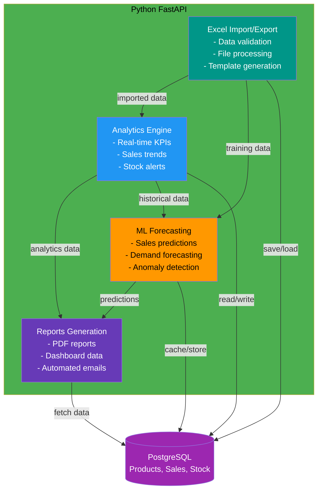
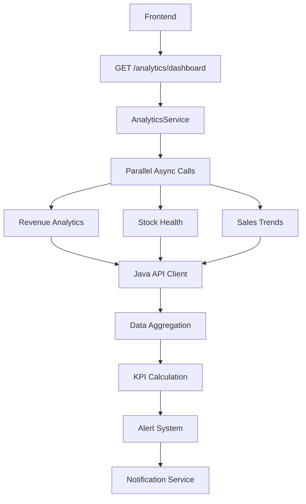
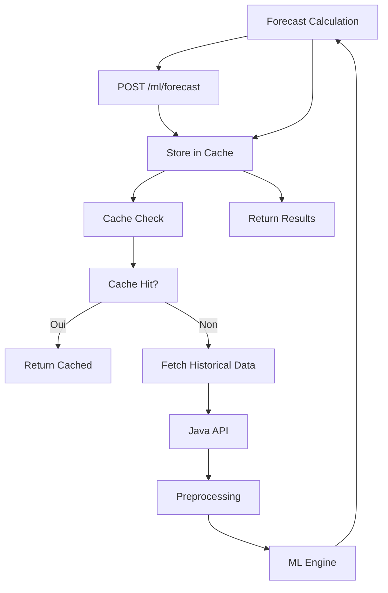
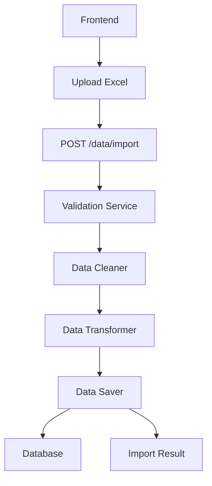
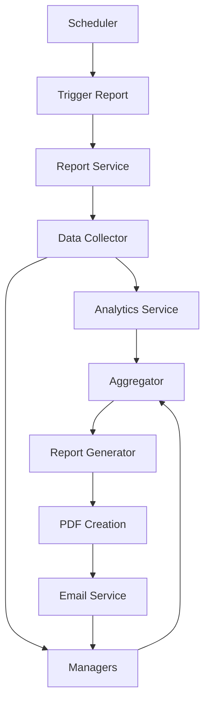
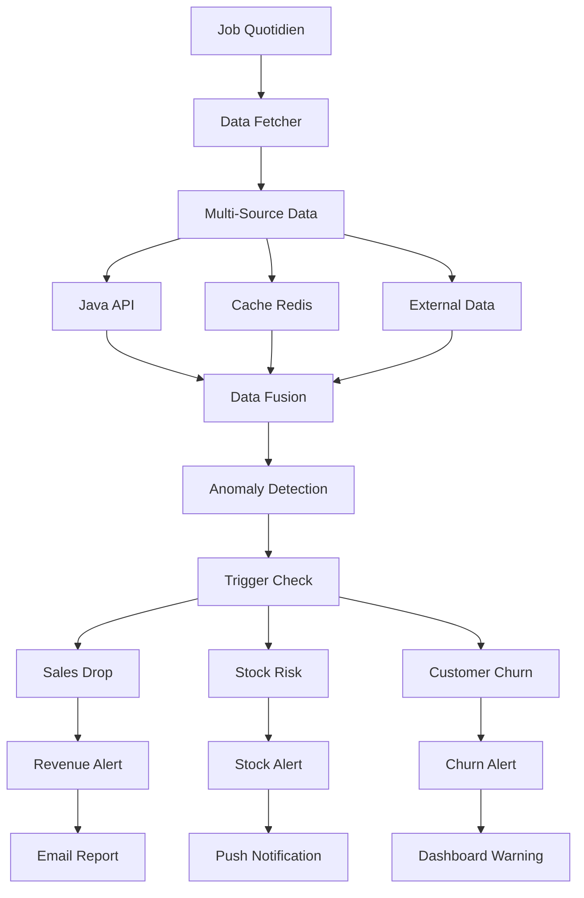
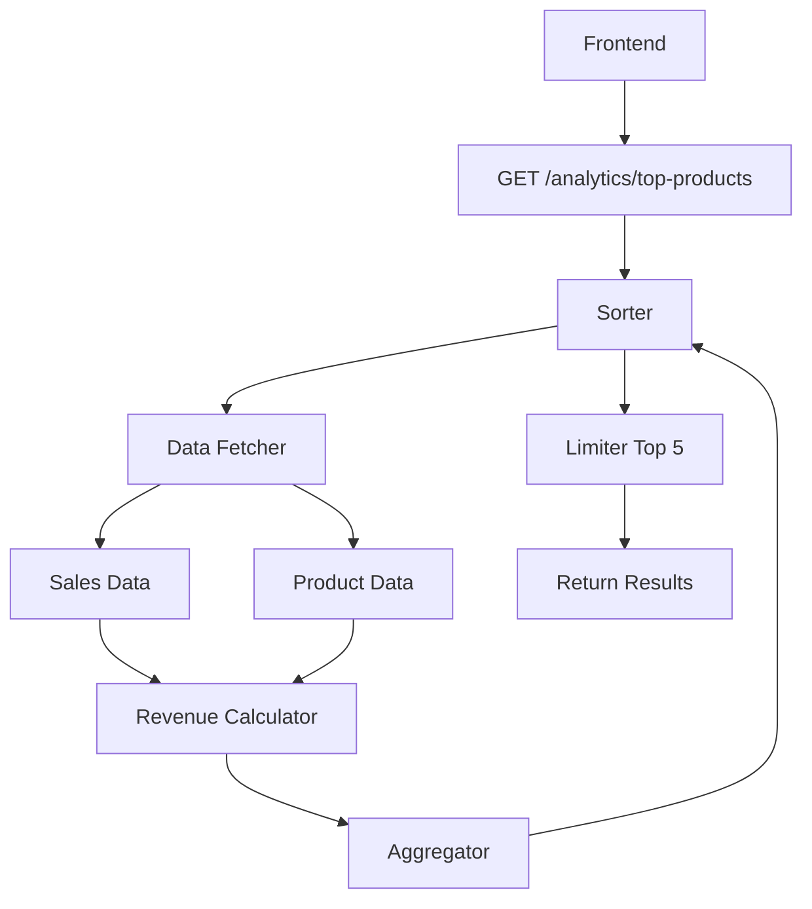
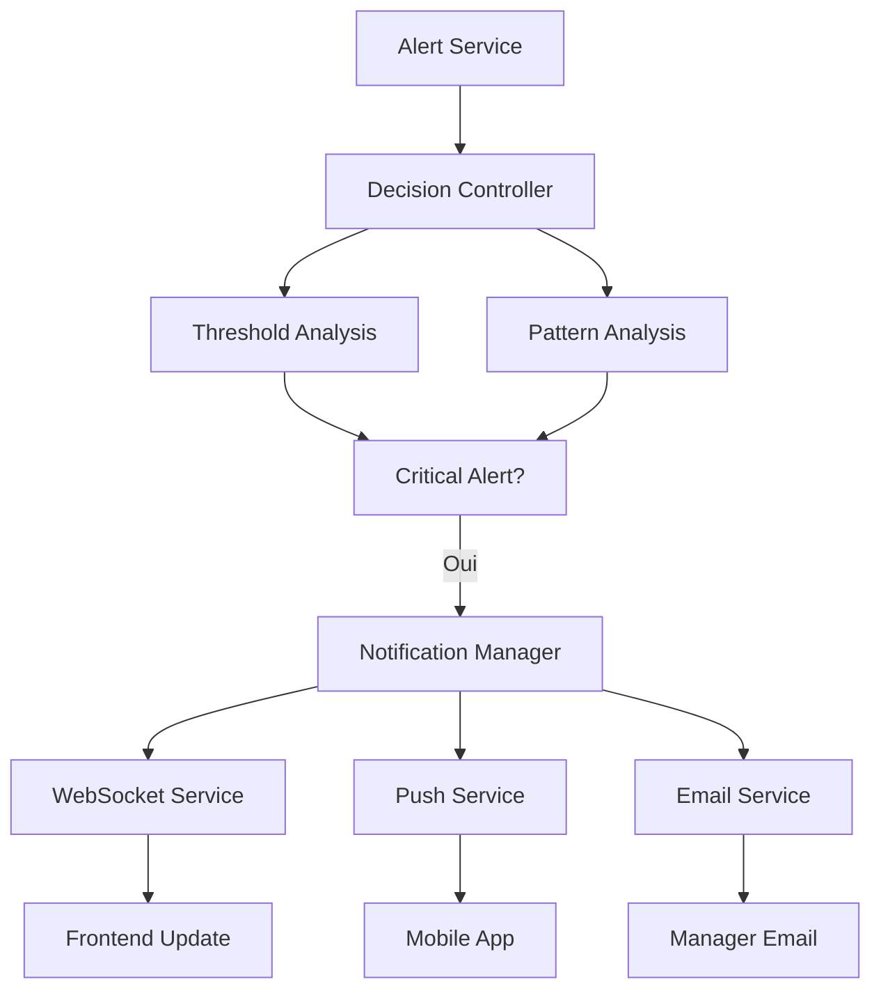

```mermaid
graph TD
    %% ==================== COUCHE API FASTAPI ====================
    subgraph FastAPI[Python FastAPI]
        A1[Analytics Engine<br/>- Real-time KPIs<br/>- Sales trends<br/>- Stock alerts]
        A2[ML Forecasting<br/>- Sales predictions<br/>- Demand forecasting<br/>- Anomaly detection]
        A3[Excel Import/Export<br/>- Data validation<br/>- File processing<br/>- Template generation]
        A4[Reports Generation<br/>- PDF reports<br/>- Dashboard data<br/>- Automated emails]
    end

    %% ==================== CONNECTIONS INTERNES ====================
    A3 -->|imported data| A1
    A3 -->|training data| A2
    A1 -->|analytics data| A4
    A2 -->|predictions| A4
    A1 -->|historical data| A2

    %% ==================== CONNECTIONS EXTERNES ====================
    A1 -->|read/write| DB[(PostgreSQL<br/>Products, Sales, Stock)]
    A2 -->|cache/store| DB
    A3 -->|save/load| DB
    A4 -->|fetch data| DB

    %% ==================== STYLES ====================
    style FastAPI fill:#4caf50,color:black
    style DB fill:#9c27b0,color:white
    style A1 fill:#2196f3,color:white
    style A2 fill:#ff9800,color:black
    style A3 fill:#009688,color:white
    style A4 fill:#673ab7,color:white
```

# relationships:

* **Excel Import/Export** → provides data to other modules
* **Analytics Engine** → feeds reports and machine learning
* **ML Forecasting** → enhances reports with predictions
* **Reports Generation** → aggregates all data to create reports
* **PostgreSQL** → central database shared by all modules

* # **Feature Scenarios with Conceptual Architecture**

## **📊 SCÉNARIO 1: DASHBOARD TEMPS RÉEL**

### **🎯 Concept**
Dashboard affichant les métriques commerciales en temps réel avec alertes automatiques

### **🏗️ Architecture**

```mermaid
graph TD
    F[Frontend] --> A[GET /analytics/dashboard]
    A --> S[AnalyticsService]
    S --> P1[Parallel Async Calls]
    
    P1 --> D1[Revenue Analytics]
    P1 --> D2[Stock Health] 
    P1 --> D3[Sales Trends]
    
    D1 --> J[Java API Client]
    D2 --> J
    D3 --> J
    
    J --> AG[Data Aggregation]
    AG --> K[KPI Calculation]
    K --> AL[Alert System]
    AL --> N[Notification Service]
```

### **📦 Composants**
- **Package**: `src.services`
- **Module**: `analytics_service.py`
- **Classe**: `RealTimeAnalyticsService`
- **Data Structure**: `DashboardDTO`
- **Fonction**: `get_dashboard_data()`

---

## **🤖 SCÉNARIO 2: FORECASTING VENTES 7 JOURS**

### **🎯 Concept**
Prédiction des ventes futures using régression linéaire avec cache intelligent

### **🏗️ Architecture**

```mermaid
graph TD
    F[Frontend] --> A[POST /ml/forecast]
    A --> S[MLService]
    S --> C[Cache Check]
    C --> H[Cache Hit?]
    
    H -->|Oui| R[Return Cached]
    H -->|Non| D[Fetch Historical Data]
    
    D --> J[Java API]
    J --> P[Preprocessing]
    P --> M[ML Engine]
    M --> F[Forecast Calculation]
    F --> S[Store in Cache]
    S --> RES[Return Results]
```

### **📦 Composants**
- **Package**: `src.services`
- **Module**: `ml_service.py`
- **Classe**: `PredictiveAnalyticsService`
- **Data Structure**: `ForecastResultDTO`
- **Fonction**: `forecast_sales()`

---

## **📁 SCÉNARIO 3: IMPORT/EXPORT EXCEL**

### **🎯 Concept**
Import de fichiers Excel avec validation et export des données analytiques

### **🏗️ Architecture**

```mermaid
graph TD
    F[Frontend] --> U[Upload Excel]
    U --> A[POST /data/import]
    A --> V[Validation Service]
    V --> C[Data Cleaner]
    C --> T[Data Transformer]
    T --> S[Data Saver]
    S --> DB[Database]
    S --> R[Import Result]
```

### **📦 Composants**
- **Package**: `src.data`
- **Module**: `file_processor.py`
- **Classe**: `ExcelProcessor`
- **Data Structure**: `ImportResultDTO`
- **Fonction**: `process_excel_import()`

---

## **📄 SCÉNARIO 4: GÉNÉRATION RAPPORTS AUTOMATISÉS**

### **🎯 Concept**
Génération automatique de rapports PDF avec envoi email aux managers

### **🏗️ Architecture**

```mermaid
graph TD
    S[Scheduler] --> T[Trigger Report]
    T --> RS[Report Service]
    RS --> DC[Data Collector]
    DC --> A[Analytics Service]
    DC --> M[ML Service]
    
    A --> AG[Aggregator]
    M --> AG
    
    AG --> RG[Report Generator]
    RG --> PDF[PDF Creation]
    PDF --> ES[Email Service]
    ES --> M[Managers]
```

### **📦 Composants**
- **Package**: `src.services`
- **Module**: `report_service.py`
- **Classe**: `AutomatedReportingService`
- **Data Structure**: `GeneratedReportDTO`
- **Fonction**: `generate_daily_report()`

---

## **🚨 SCÉNARIO 5: SYSTÈME D'ALERTES INTELLIGENTES**

### **🎯 Concept**
Détection automatique d'anomalies et notifications multi-canaux

### **🏗️ Architecture**

```mermaid
graph TD
    J[Job Quotidien] --> DF[Data Fetcher]
    DF --> MS[Multi-Source Data]
    
    MS --> JAPI[Java API]
    MS --> C[Cache Redis]
    MS --> E[External Data]
    
    JAPI --> FU[Data Fusion]
    C --> FU
    E --> FU
    
    FU --> AD[Anomaly Detection]
    AD --> T[Trigger Check]
    
    T --> SD[Sales Drop]
    T --> SR[Stock Risk] 
    T --> CC[Customer Churn]
    
    SD --> RA[Revenue Alert]
    SR --> SA[Stock Alert]
    CC --> CA[Churn Alert]
    
    RA --> ER[Email Report]
    SA --> PN[Push Notification]
    CA --> DW[Dashboard Warning]
```

### **📦 Composants**
- **Package**: `src.services`
- **Module**: `alert_service.py`
- **Classe**: `IntelligentAlertSystem`
- **Data Structure**: `AlertDTO`
- **Fonction**: `check_business_anomalies()`

---

## **💰 SCÉNARIO 6: TOP 5 PRODUITS PAR REVENUE**

### **🎯 Concept**
Identification et ranking des produits les plus performants

### **🏗️ Architecture**

```mermaid
graph TD
    F[Frontend] --> A[GET /analytics/top-products]
    A --> S[Analytics Service]
    S --> DF[Data Fetcher]
    
    DF --> SD[Sales Data]
    DF --> PD[Product Data]
    
    SD --> C[Revenue Calculator]
    PD --> C
    
    C --> AG[Aggregator]
    AG --> S[Sorter]
    S --> L[Limiter Top 5]
    L --> R[Return Results]
```

### **📦 Composants**
- **Package**: `src.services`
- **Module**: `analytics_service.py`
- **Classe**: `ProductAnalyticsService`
- **Data Structure**: `ProductPerformanceDTO`
- **Fonction**: `get_top_products_by_revenue()`

---

## **📱 SCÉNARIO 7: NOTIFICATIONS PUSH TEMPS RÉEL**

### **🎯 Concept**
Notifications instantanées pour alertes critiques stock/ventes

### **🏗️ Architecture**

```mermaid
graph TD
    AS[Alert Service] --> DC[Decision Controller]
    DC --> TA[Threshold Analysis]
    DC --> PA[Pattern Analysis]
    
    TA --> CA[Critical Alert?]
    PA --> CA
    
    CA -->|Oui| NM[Notification Manager]
    NM --> WS[WebSocket Service]
    NM --> PS[Push Service]
    NM --> ES[Email Service]
    
    WS --> F[Frontend Update]
    PS --> M[Mobile App]
    ES --> EM[Manager Email]
```

### **📦 Composants**
- **Package**: `src.api`
- **Module**: `websocket_manager.py`
- **Classe**: `RealTimeNotificationService`
- **Data Structure**: `NotificationDTO`
- **Fonction**: `send_critical_alert()`

---

## **🎯 RÉSUMÉ DES COMPOSANTS PAR SCÉNARIO**

| Scénario | Package | Module | Classe | Data Structure |
|----------|---------|--------|--------|----------------|
| Dashboard | `services` | `analytics_service.py` | `RealTimeAnalyticsService` | `DashboardDTO` |
| Forecasting | `services` | `ml_service.py` | `PredictiveAnalyticsService` | `ForecastResultDTO` |
| Excel Import | `data` | `file_processor.py` | `ExcelProcessor` | `ImportResultDTO` |
| Reports | `services` | `report_service.py` | `AutomatedReportingService` | `GeneratedReportDTO` |
| Alertes | `services` | `alert_service.py` | `IntelligentAlertSystem` | `AlertDTO` |
| Top Produits | `services` | `analytics_service.py` | `ProductAnalyticsService` | `ProductPerformanceDTO` |
| Notifications | `api` | `websocket_manager.py` | `RealTimeNotificationService` | `NotificationDTO` |

Cette organisation permet une **séparation claire des responsabilités** et une **évolution indépendante** de chaque feature ! 🚀
