```mermaid
graph TD
    %% ==================== OUR APPLICATION ====================
    subgraph OurApp[Our Analytics Application]
        PythonApp[Python Analytics Engine<br/>🧠 Intelligent Brain]
    end

    %% ==================== USERS ====================
    subgraph Users[Users]
        Manager[Business Manager<br/>📊 Makes decisions]
        Analyst[Data Analyst<br/>📈 Analyzes trends]
        Operator[Operator<br/>📥 Manages data]
    end

    %% ==================== CONNECTED SYSTEMS ====================
    subgraph ConnectedSystems[Connected Systems]
        BusinessSystem[Main Business System<br/>🏢 Manages products/sales]
        DataStorage[(Database<br/>💾 Permanent storage)]
        CacheSystem[Redis Cache<br/>⚡ Fast access]
        Notification[Notification System<br/>📧 Sends emails]
        FileSystem[File System<br/>📁 Excel/PDF/CSV]
    end

    %% ==================== INTERACTIONS ====================
    %% Users -> Our App
    Manager -->|Views dashboards| PythonApp
    Analyst -->|Requests forecasts| PythonApp
    Operator -->|Imports Excel files| PythonApp

    %% Our App -> Systems
    PythonApp -->|Gets business data| BusinessSystem
    PythonApp -->|Stores temporary results| CacheSystem
    PythonApp -->|Sends reports & alerts| Notification
    PythonApp -->|Reads/writes files| FileSystem

    %% Systems between themselves
    BusinessSystem -->|Saves data| DataStorage

    %% ==================== STYLES ====================
    style OurApp fill:#4caf50,color:black
    style Users fill:#2196f3,color:white
    style ConnectedSystems fill:#ff9800,color:black
    style PythonApp fill:#2e7d32,color:white
``` 

```mermaid
sequenceDiagram
    participant F as Frontend
    participant P as Python FastAPI
    participant J as Java Spring Boot
    participant DB as PostgreSQL
    
    F->>P: GET /analytics/dashboard
    P->>J: GET /api/sales (ventes brutes)
    P->>J: GET /api/products (produits bruts)
    J->>DB: SELECT * FROM sales, products
    DB-->>J: Données brutes
    J-->>P: JSON des données
    P->>P: 🧠 CALCULS ANALYTICS
    Note over P: Total ventes, tendances, alertes stock
    P-->>F: DashboardDTO avec analytics
```

```mermaid
sequenceDiagram
    participant F as Frontend
    participant P as Python FastAPI
    participant J as Java Spring Boot
    
    F->>P: POST /ml/forecast
    P->>J: GET /api/sales/history
    J-->>P: Historique ventes 90 jours
    P->>P: 🧠 ENTRAÎNEMENT MODÈLE ML
    P->>P: 🧠 PRÉDICTIONS 7 jours
    P-->>F: ForecastResultDTO
```

```mermaid
sequenceDiagram
    participant F as Frontend
    participant P as Python FastAPI
    participant J as Java Spring Boot
    
    F->>P: POST /data/import (fichier Excel)
    P->>P: 📊 LECTURE FICHIER Excel
    P->>P: 🛡️ VALIDATION DONNÉES
    P->>P: 🔧 TRANSFORMATION
    P->>J: POST /api/products/bulk
    J-->>P: Confirmation création
    P-->>F: ImportResultDTO
```

```mermaid
sequenceDiagram
    participant S as Scheduler
    participant P as Python FastAPI
    participant J as Java Spring Boot
    
    S->>P: Générer rapport quotidien
    P->>J: GET /api/sales/daily
    P->>J: GET /api/products
    J-->>P: Données brutes
    P->>P: 📈 ANALYTICS AVANCÉES
    P->>P: 📊 CRÉATION PDF/Excel
    P->>P: 📧 ENVOI EMAIL
```

```mermaid
sequenceDiagram
    participant S as Scheduler
    participant P as Python FastAPI
    participant J as Java Spring Boot
    
    S->>P: Vérifier alertes
    P->>J: GET /api/sales/recent
    P->>J: GET /api/stock/levels
    J-->>P: Données récentes
    P->>P: 🔍 DÉTECTION ANOMALIES
    P->>P: 📢 CRÉATION ALERTES
    P->>P: 📧 NOTIFICATIONS
```

# relationships:

*  *🏢 Business System → For product/sales data*
*  *💾 Database → (via business system)*
*  *⚡ Redis Cache → For faster access*
*  *📧 Email System → To send alerts*
*  *📁 File System → To read/write Excel/PDF*
  
# **🏗️ SALES FLOW ARCHITECTURE**

# *INTERACTION MODEL*

## **📊 SCÉNARIO 1: DASHBOARD TEMPS RÉEL**

### **🎯 Concept**
Dashboard qui montre les performances business en temps réel avec calculs analytics

### **🔄 Flux Réel**


### **📦 Composants Python**
- **Package**: `src.services`
- **Module**: `analytics_service.py`
- **Classe**: `DashboardService`
- **Fonction**: `get_dashboard_data()`


---

## **🤖 SCÉNARIO 2: FORECASTING VENTES 7 JOURS**

### **🎯 Concept**
Prédire les ventes futures avec machine learning

### **🔄 Flux Réel**


### **📦 Composants Python**
- **Package**: `src.services`
- **Module**: `ml_service.py`
- **Classe**: `ForecastingService`
- **Fonction**: `predict_sales()`


---

## **📁 SCÉNARIO 3: IMPORT/EXPORT EXCEL**

### **🎯 Concept**
Importer des données Excel, les valider et les envoyer à Java

### **🔄 Flux Réel**


### **📦 Composants Python**
- **Package**: `src.data`
- **Module**: `file_processor.py`
- **Classe**: `ExcelProcessor`
- **Fonction**: `process_import()`


---

## **📄 SCÉNARIO 4: RAPPORTS AUTOMATISÉS**

### **🎯 Concept**
Générer des rapports PDF/Excel avec analytics

### **🔄 Flux Réel**


### **📦 Composants Python**
- **Package**: `src.services`
- **Module**: `report_service.py`
- **Classe**: `ReportGenerator`
- **Fonction**: `generate_daily_report()`


---

## **🚨 SCÉNARIO 5: SYSTÈME D'ALERTES INTELLIGENTES**

### **🎯 Concept**
Détecter automatiquement les anomalies business

### **🔄 Flux Réel**


### **📦 Composants Python**
- **Package**: `src.services`
- **Module**: `alert_service.py`
- **Classe**: `AlertSystem`
- **Fonction**: `check_business_alerts()`


---

## **✅ SUMMARY**

| Scénario | Java Spring Boot | Python FastAPI |
|----------|------------------|----------------|
| **Dashboard** | Données brutes | **Calculs analytics** |
| **Forecasting** | Historique ventes | **Machine Learning** |
| **Excel Import** | Sauvegarde données | **Validation + Transformation** |
| **Rapports** | Données brutes | **Analytics + Génération** |
| **Alertes** | Données récentes | **Détection anomalies** |

**Java = Source de vérité des données**  
**Python = Cerveau analytics/intelligence** 🧠

# *STRUCTURAL MODEL*

```mermaid
graph TD
    %% Relations principales entre composants
    Routes --> Services
    Services --> DataAccess
    Services --> Models
    DataAccess --> External[Java API]
    
    subgraph InternalStructure [Structure Interne]
        Routes[Routes FastAPI]
        Services[Services Métier]
        DataAccess[Accès Données]
        Models[Modèles DTO]
    end

    subgraph ExternalSystems [Systèmes Externes]
        External
        Redis[Cache Redis]
        Files[Système Fichiers]
    end

    DataAccess --> Redis
    DataAccess --> Files

    style InternalStructure fill:#e3f2fd,color:black
    style ExternalSystems fill:#f3e5f5,color:black
```



## *SUMMARY*
| Layer       | Responsibilities                  | Technologies                  |
|-------------|-----------------------------------|-------------------------------|
| Presentation | API Endpoints, Validation, Security | FastAPI, Pydantic, JWT       |
| Business    | Business Logic, Calculations, Analytics | Python, Pandas, Scikit-learn |
| Data        | Data Access, Cache, Integration   | HTTPX, Redis, Pandas         |
| Models      | Data Structures, Validation       | Pydantic, Python classes     |
| Utilities   | Reusable Functions, Helpers       | Python standard library      |

# *BEHAVIOR MODEL*
## *REAL-TIME DASHBOARD BEHAVIOR*

Key Behaviors:

    Cache-first strategy for performance
    Parallel data fetching from Java API
    Real-time business calculations
    Automatic cache invalidation
    
## **ML FORECASTINF BEHAVIOR**

Key Behaviors:

    Automated model training on demand
    Confidence scoring for predictions
    Historical data preparation
    Real-time inference
## *EXCEL IMPORT BEHAVIOR*

Key Behaviors:

    Row-by-row validation pipeline
    Batch processing for efficiency
    Comprehensive error tracking    
    Atomic bulk operations

## *AUTOMATED REPORTING BEHAVIOR*
  ``` mermaid
  sequenceDiagram
    title AUTOMATED REPORT GENERATION BEHAVIOR

    participant Scheduler as Cron Scheduler
    participant API as FastAPI Reports
    participant Java as Java API
    participant Analytics as Analytics Engine
    participant PDF as PDF Generator
    participant Email as Email Service

    Note over Scheduler: Daily at 8:00 AM
    Scheduler->>API: Trigger report generation
    API->>Java: GET /api/sales/daily
    API->>Java: GET /api/products
    Java-->>API: Complete business data
    API->>Analytics: Calculate advanced KPIs
    Analytics-->>API: Business insights
    API->>PDF: Generate professional PDF
    PDF-->>API: PDF file buffer
    API->>Email: Send to managers list
    Email-->>API: Delivery confirmation
    API-->>Scheduler: Generation complete
```
Key Behaviors:

    Time-based automation
    Sequential workflow execution
    Professional document generation
    Email distribution system

## *INTELLIGENT ALERTING BEHAVIOR*

Key Behaviors:

    Continuous monitoring
    Multi-condition alert detection
    Proactive notification system
    Health status logging

## * PERFORMANCE CACHING BEHAVIOR*

Key Behaviors:

Cache-aside pattern,
Performance optimization,
Graceful degradation,
Automatic cache warming.
### *SUMMARY*
| Feature          | Behavior Type              | Key Dynamics                          |
|------------------|----------------------------|---------------------------------------|
| Dashboard        | Real-time + Cache          | Fast response, parallel processing    |
| ML Forecasting   | Predictive + Training      | Model lifecycle, confidence scoring   |
| Excel Import     | Batch + Validation         | Row processing, error handling        |
| Automated Reports| Scheduled + Sequential     | Time-based triggers, workflow         |
| Alert System     | Reactive + Monitoring      | Event detection, notification         |
| Caching          | Performance + Optimization | Cache strategies, fallback            |
