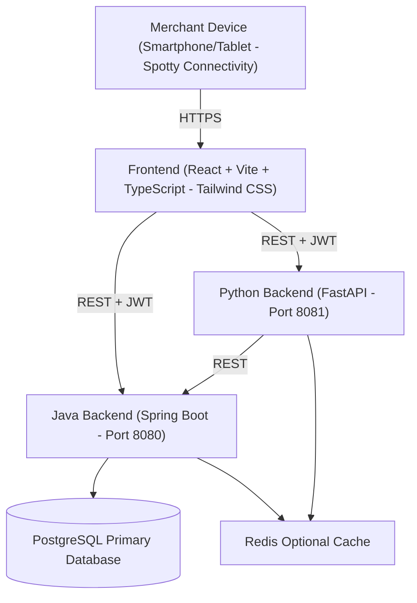
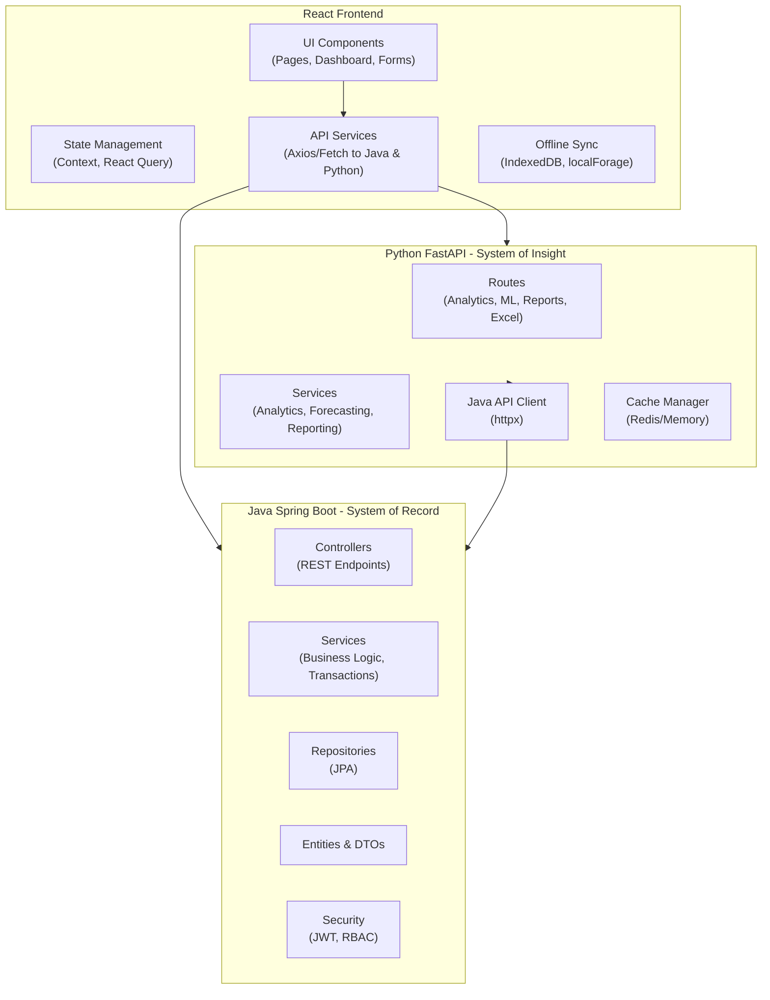
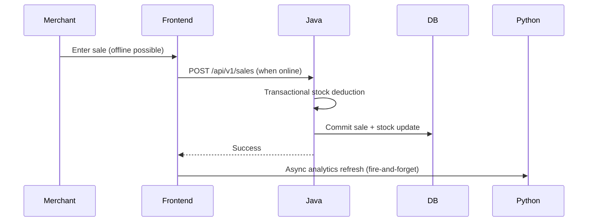
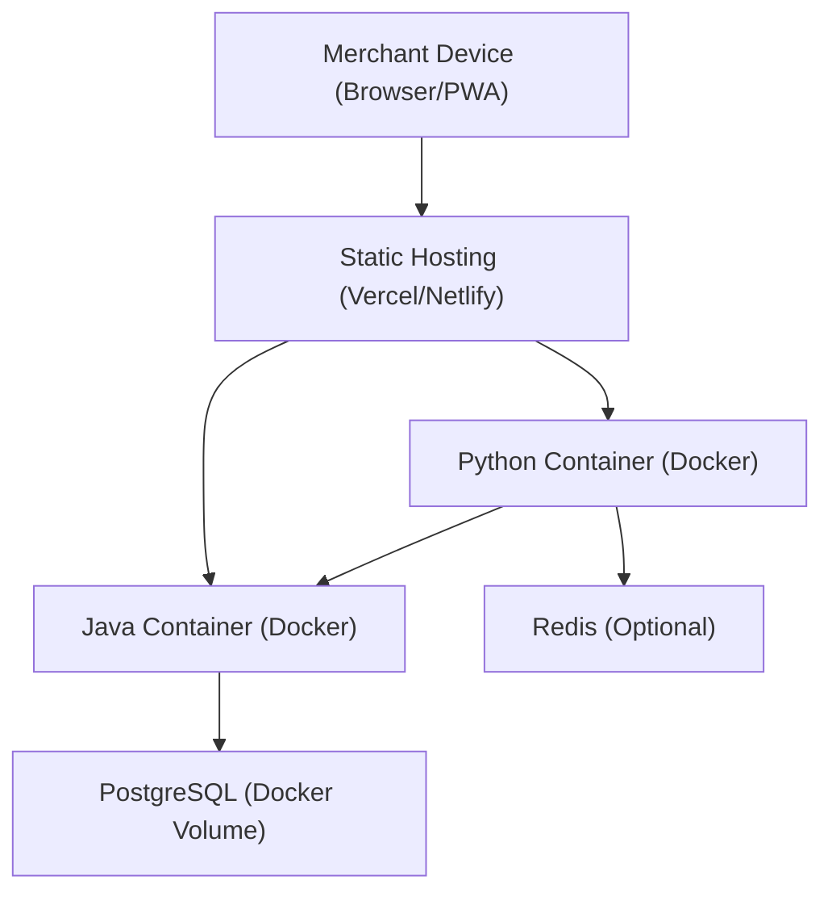

# SalesFlow-Lite – Software Architecture

*A lightweight, modular sales management system built with Java, Python, and React.*

---

## 🔑 Overview

SalesFlow-Lite follows a **modular, service-oriented architecture** that separates **core business logic**, **analytics/ML features**, and **frontend UI** for scalability, maintainability, and team independence.

---

## 🧩 Core System Components

- **Frontend (React + Vite + TypeScript + Tailwind CSS)**: Multilingual UI, offline mode, real-time dashboards  
- **Java API (Spring Boot)**: Core business logic (CRUD, sales, stock, authentication)  
- **Python API (FastAPI)**: Analytics, ML forecasting, Excel import/export, reporting  
- **Database (PostgreSQL)**: Products, sales, users, and stock data  
- **Optional Cache (Redis)**: For performance optimization in analytics  

---

## ✅ Design Principles

1. **Separation of Concerns** – Each layer has a single responsibility  
2. **Minimalist & Multilingual** – English, French, Lingala, Swahili (using i18next)  
3. **Scalability** – APIs and database can be scaled independently  
4. **Maintainability** – Clear modular boundaries with SOLID principles applied  
5. **Performance** – Direct frontend-to-Java communication for critical operations  

---

## 🗺 High-Level System Context



### Core Responsibilities

- **Java**: Product/Sale CRUD, stock adjustments, authentication, low-stock alerts  
- **Python**: Sales/stock analytics, forecasting, anomaly detection, Excel import, report generation  
- **Frontend**: Unified UI, offline sales entry, dashboard visualization, multilingual support  

---

## 🏗 Kruchten's 4+1 Architectural View Model

### 1. Logical View (Functional Components & Responsibilities)




### 2. Development View (Code Organization)

#### Java Backend
```plaintext
src/main/java/com/SalesFlowLite/inventory/
├── config/         # App configuration (Security, Web, Async)
├── controller/     # REST APIs
├── service/        # Business logic
├── repository/     # JPA repositories
├── model/
│   ├── entity/     # JPA entities
│   └── dto/        # API contracts
├── security/       # JWT & RBAC
└── exception/      # Global error handling
```

**Rules**  
- Controllers never access repositories directly  
- Services define transactional boundaries  
- DTOs isolate internal models from API contracts  

#### Python Backend
```plaintext
src/
├── api/
│   └── routes/     # FastAPI routers (analytics, ml, reports, excel, etc.)
├── services/       # Business logic (analytics, ml, reports, excel, alerts)
├── clients/        # Java API clients (httpx)
├── data/           # Cache manager & file processing
├── models/         # Pydantic schemas
└── integration/    # JWT validation & shared utils
```

**Rules**  
- Routes → Services → Clients / Cache / File System  
- Services are data-source agnostic  
- Explicit DEV and PROD modes  

#### Frontend (React)
```plaintext
src/
├── features/       # Feature-based folders (sales/, products/, analytics/, etc.)
├── components/     # Reusable UI components
├── services/       # API facades (Axios/fetch to Java & Python)
├── context/        # Global state (AuthContext, etc.)
├── hooks/          # Custom hooks
└── types/          # TypeScript interfaces
```

**Rules**  
- No direct API calls in components  
- Services act as facades  
- DTO mapping via adapters  

### 3. Process View (Runtime Behavior)

#### Key Scenario: Quick Sale (Transactional)


### 4. Physical View (Deployment)



**Deployment Options**  
- **Local**: `docker-compose up` (Java:8080, Python:8081, Frontend dev server)  
- **Production**: Kubernetes or separate hosts with HTTPS termination  

### +1 Scenarios View (Key Use Cases)

Here are the primary use cases that drive the system's behavior:

- **UC1 — Authenticate**  
  Login via Java → JWT token → stored in Frontend (AuthContext/memory)

- **UC2 — View Sales Analytics** (Python pipeline)  
  UI → Python → (cache check) → Java fetch → compute KPIs/trends → response

- **UC3 — View Stock Analytics** (Python pipeline)  
  Similar to UC2, focused on stock levels, KPIs, and potential stockouts

- **UC4 — View Stock Alerts / Anomalies**  
  UI → Python anomalies detection → (cache/job) → display alert badges/state

- **UC5 — Import Excel** (Python pipeline)  
  UI upload file → Python parse/validate rows → call Java batch endpoints → return summary/preview

- **UC6 — Generate Report** (PDF/Excel job)  
  Request job creation → background generation → polling for status → download artifact

- **UC7 — Schedule Reports** (APScheduler)  
  Define scheduling rules → recurring jobs → artifacts generated and ready

- **UC8 — Forecast Sales** (ML pipeline)  
  Fetch sales history from Java → train/predict model in Python → display forecast

- **UC9 — Detect Anomalies + Send Alerts** (Alerting pipeline)  
  Background compute anomalies → trigger notifications (e.g., email/UI)

---

### Database (PostgreSQL)

- **Core Business Schema**: `products`, `sales`, `users`, `stock_movements`  
- **Analytics Schema**: Materialized views, ML feature tables  
- **Operational Schema**: `logs`, `audits`, cached data  

---

