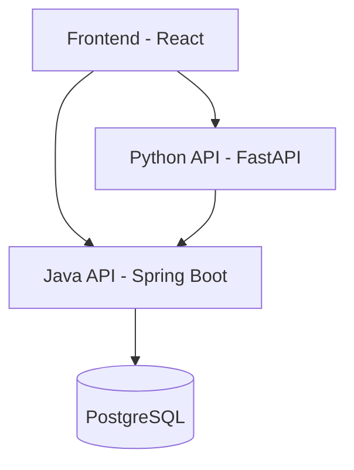

# 🏗 SalesFlow Lite – Software Architecture

*A lightweight, modular sales management system built with Java, Python, and React.*  

---

## 🔑 Overview

SalesFlow Lite follows a **modular, service-oriented architecture** that separates **core business logic**, **analytics/ML features**, and **frontend UI** for scalability, maintainability, and team independence.

---

## 🖼 High-Level Architecture



- **Frontend (React)**: Multilingual UI, offline mode, real-time dashboards  
- **Java API (Spring Boot)**: Core business logic (CRUD, sales, stock, authentication)  
- **Python API (FastAPI)**: Analytics, ML forecasting, Excel import/export, reporting  
- **Database (PostgreSQL)**: Products, sales, users, and stock data  

---

## ✅ Design Principles

1. **Separation of Concerns** – Each layer has a single responsibility  
2. **Team Autonomy** – Java & Python APIs are ~85% independent  
3. **Scalability** – APIs and DB can be scaled independently  
4. **Maintainability** – Clear modular boundaries, SOLID principles applied  
5. **Performance** – Direct frontend-to-Java communication for critical ops  

---

## 📌 Key Scenarios

### 1. Quick Sale Flow
1. User enters sale in React  
2. React → Java API → DB update (stock, sales, alerts)  
3. Java asynchronously notifies Python for analytics  
4. Success returned to user  

### 2. Data Analysis with Excel
1. User uploads Excel in React  
2. React → Python API (parse, analyze)  
3. Python ↔ Java for reference data  
4. Insights + charts returned to React  

### 3. Real-Time Dashboard
1. React requests data in parallel  
2. Java API → Sales stats  
3. Python API → Trends & analytics  
4. React merges & displays unified dashboard  

---

## 📂 Backend Java – Layered Architecture

```plaintext
src/main/java/com/salesflowlite/
├── config/         # Spring configs (Security, Web, Async)
├── controller/     # REST controllers
├── service/        # Business logic services
├── repository/     # Data access (JPA Repos)
├── model/          # Entities + DTOs
├── security/       # Authentication & Authorization (JWT)
└── exception/      # Error handling
```

- **Controller Layer** – REST endpoints, validation, exception handling  
- **Service Layer** – Core domain logic (sales, stock, alerts)  
- **Repository Layer** – Database access with JPA  
- **Security Layer** – JWT-based auth  
- **Integration Layer** – Calls to Python API, payment gateways  

---

## 🐍 Backend Python – Modular MVP

- **API Layer (FastAPI)** – Routes for analytics, ML, reporting  
- **Service Layer** – Real-time analytics, predictive engine, reporting automation  
- **Data Layer** – Java API client, Redis cache, file processor  

---

## 🗄 Database (PostgreSQL)

- **Core Business Schema**: `products`, `sales`, `users`, `stock_movements`  
- **Analytics Schema**: Materialized views, ML features tables  
- **Operational Schema**: `logs`, `audits`, cache data  

Optimizations:
- Partitioned sales tables (by date)  
- Materialized views for fast dashboards  
- Indexing for performance  
- Row-level security (RLS) for sensitive data  

---

## 🎨 Frontend (React)

- **Feature-based structure**: `dashboard/`, `sales/`, `products/`, `analytics/`  
- **Shared modules**: UI components, hooks, utils  
- **Service layer**: API communication (Java & Python)  
- **State management**: Centralized via hooks + context  

Patterns:
- Unidirectional data flow  
- Offline-first with local storage & sync queue  
- Reusable presentational components  

---

## 🚀 Advantages

- 🔄 **Parallel team development** – Java & Python teams work independently  
- 📊 **Business-first design** – Core sales features + analytics MVP  
- ⚡ **Performance-ready** – Async calls, caching, partitioning  
- 🛡 **Robust & secure** – SOLID principles, RLS, JWT auth  
- 📈 **Future-proof** – Easy scaling & new module integration  

---

## 📏 Success Metrics

- **Clarity** – Each module has a clear role  
- **Cohesion** – APIs follow predictable patterns  
- **Capacity** – Scales horizontally per API  
- **Change-ready** – Easy feature extension  
- **Cost-efficient** – Parallel dev saves time  

---

